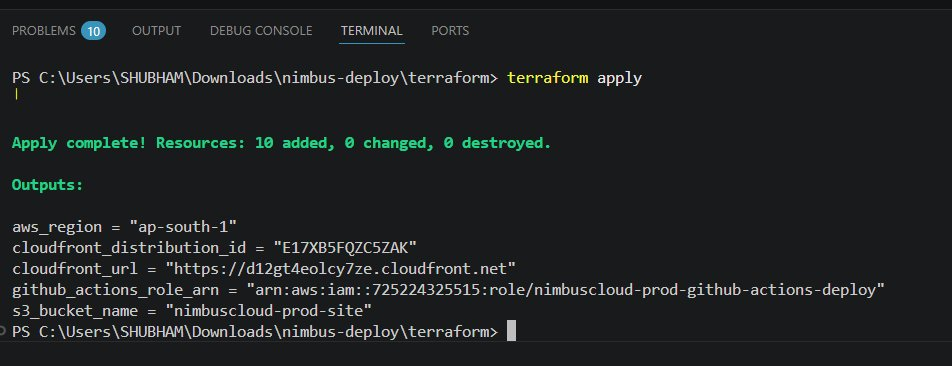
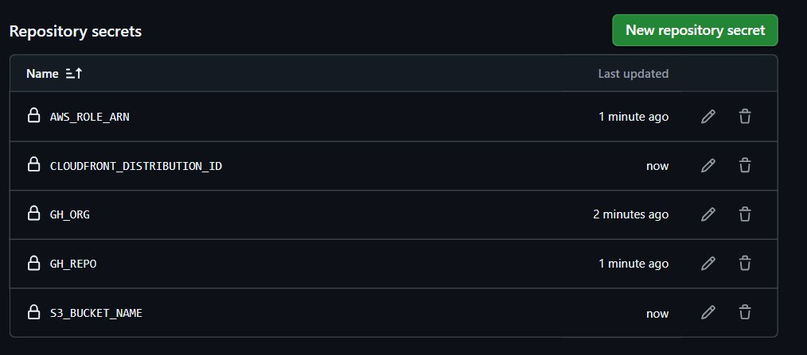
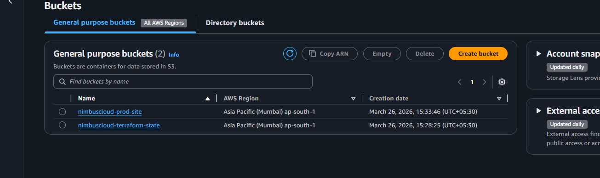

# ☁ NimbusCloud
### Cloud-Native Static Site Delivery System
**AWS S3 · CloudFront · IAM · Terraform · GitHub Actions**

> Push to GitHub → GitHub Actions triggers → Syncs to S3 → CloudFront serves globally over HTTPS.

---

## 📁 Project Structure

```
NimbusCloud/
├── .github/workflows/
│   ├── deploy.yml              # Auto deploy on every push to main
│   └── destroy.yml             # Manual destroy to delete all infrastructure
├── assets/                     # README screenshots
├── src/
│   ├── index.html              # Static website
│   ├── style.css               # Styles
│   └── nimbus.js               # JavaScript
├── terraform/
│   ├── backend.tf              # Remote state — S3 + DynamoDB
│   ├── iam.tf                  # GitHub Actions IAM Role via OIDC
│   ├── main.tf                 # S3 bucket + CloudFront CDN
│   ├── outputs.tf              # Prints URLs + ARNs after apply
│   └── variables.tf            # Region, project name, GitHub details
├── .gitignore
└── README.md
```

---

## 🏗️ Architecture

```
Developer
    │
    │  git push
    ▼
GitHub Actions
    │
    ├── Assumes IAM Role (OIDC — no static keys)
    │
    ├── aws s3 sync → uploads files to S3
    │
    └── CloudFront Invalidation → clears cache
                │
                ▼
        https://xxxxx.cloudfront.net  🌐
```

---

## ✅ Prerequisites

| Tool | Link |
|------|------|
| AWS CLI | https://aws.amazon.com/cli/ |
| Terraform | https://developer.hashicorp.com/terraform/install |
| Git | https://git-scm.com/ |
| AWS Account | https://aws.amazon.com/free/ |

---

## 🚀 Setup Guide

### STEP 1 — Configure AWS CLI
```bash
aws configure
```
Enter your AWS Access Key, Secret Key, region `ap-south-1`, output `json`.

---

### STEP 2 — Update `terraform/variables.tf`
```hcl
variable "github_org" {
  default = "YOUR-GITHUB-USERNAME"
}

variable "github_repo" {
  default = "NimbusCloud"
}
```

---

### STEP 3 — Create Terraform State Bucket
Run these 3 commands once in terminal:

```bash
aws s3 mb s3://nimbuscloud-terraform-state --region ap-south-1
```
```bash
aws s3api put-bucket-versioning --bucket nimbuscloud-terraform-state --versioning-configuration Status=Enabled
```
```bash
aws dynamodb create-table --table-name nimbuscloud-terraform-lock --attribute-definitions AttributeName=LockID,AttributeType=S --key-schema AttributeName=LockID,KeyType=HASH --billing-mode PAY_PER_REQUEST --region ap-south-1
```

---

### STEP 4 — Run Terraform
```bash
cd terraform
terraform init
terraform plan
terraform apply
```

After apply you will see outputs like this:



Copy all 4 output values — you need them in the next step.

---

### STEP 5 — Add GitHub Secrets

Go to your GitHub repo → **Settings** → **Secrets and variables** → **Actions** → **New repository secret**

| Secret Name | Value |
|-------------|-------|
| `AWS_ROLE_ARN` | from `github_actions_role_arn` output |
| `S3_BUCKET_NAME` | from `s3_bucket_name` output |
| `CLOUDFRONT_ID` | from `cloudfront_distribution_id` output |
| `GH_ORG` | your GitHub username |
| `GH_REPO` | your repo name |



---

### STEP 6 — Verify AWS S3 Buckets Created

Login to AWS Console → S3 — you should see 2 buckets:



| Bucket | Purpose |
|--------|---------|
| `nimbuscloud-prod-site` | Stores your website files |
| `nimbuscloud-terraform-state` | Stores Terraform state file |

---

### STEP 7 — Push Code to GitHub
```bash
git init
git add .
git commit -m "initial commit - NimbusCloud"
git branch -M main
git remote add origin https://github.com/YOUR-USERNAME/NimbusCloud.git
git push -u origin main
```

---

### STEP 8 — Watch GitHub Actions Deploy
Go to GitHub repo → **Actions** tab → watch the workflow run.

Once green ✅ your site is live at your CloudFront URL:
```
https://xxxxxx.cloudfront.net
```

---

## 🔄 Daily Workflow (After Setup)

```bash
# Make changes to your site
git add .
git commit -m "update site"
git push
# GitHub Actions auto deploys — done!
```

---

## 🗑️ Destroy Infrastructure (When Done Practicing)

Go to GitHub → **Actions** → **Destroy AWS Infrastructure** → **Run workflow** → type `DESTROY` → Run.

This deletes:
- S3 site bucket
- CloudFront distribution
- IAM Role
- All related resources

---

## 💸 Cost

| Service | Free Tier | Cost |
|---------|-----------|------|
| S3 | 5 GB free | ~$0 |
| CloudFront | 1 TB + 10M requests/month free | ~$0 |
| S3 → CloudFront transfer | Always free | $0 |
| DynamoDB | 25 GB free | $0 |
| **Total** | | **~$0/month** |

---

## ❓ Common Issues

**Workflow fails with credentials error**
→ Check GitHub secrets are spelled correctly

**Site shows old content after deploy**
→ CloudFront cache takes 30-60 seconds to clear

**terraform init fails**
→ Make sure you ran the 3 state bucket commands first

**Access Denied on S3**
→ Check `github_org` and `github_repo` in `variables.tf` match your GitHub exactly
